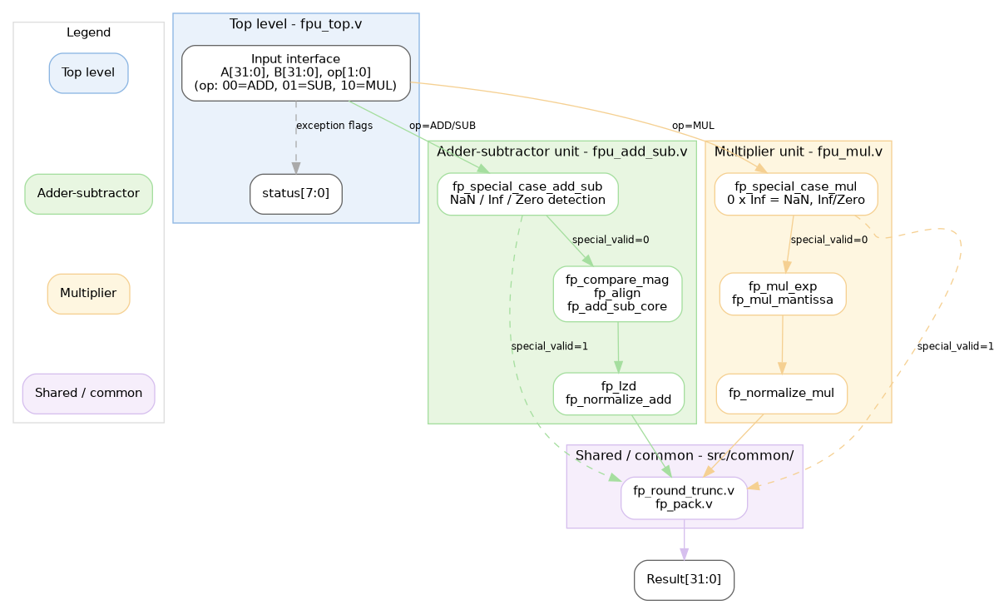
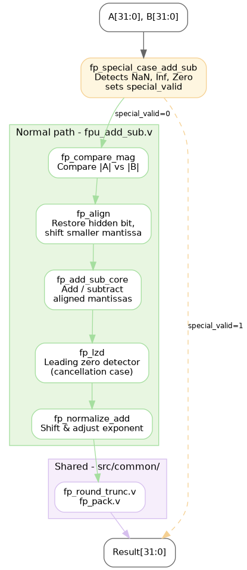
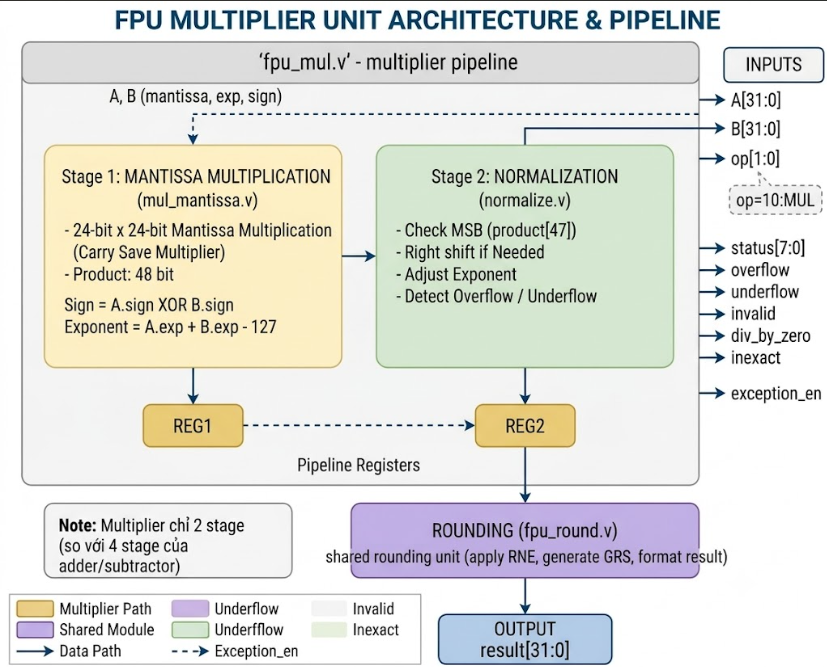

# FPU32 IEEE-754 Lite

A modular IEEE-754 single-precision Floating-Point Unit (FPU) implemented in Verilog HDL for FPGA platforms.

The project provides three implementation variants (non-pipeline, 2-stage pipeline, and 3-stage pipeline) for floating-point addition/subtraction and multiplication, enabling architectural comparison in terms of FPGA resource utilization and timing performance.

---

## Features

- IEEE-754 Single-Precision (32-bit)
- Floating-point Addition
- Floating-point Subtraction
- Floating-point Multiplication
- IEEE-754 Special Case Handling
  - NaN
  - Infinity
  - Zero
- Overflow / Underflow Detection
- Shared Rounding and Packing Modules
- Modular RTL Architecture
- FPGA-Oriented Pipeline Evaluation

---

## Project Overview

Unlike monolithic FPU implementations, this project adopts a modular architecture in which each arithmetic unit is decomposed into reusable functional modules.

The adder/subtractor and multiplier maintain independent arithmetic datapaths while converging at two shared IEEE-754 format-dependent stages:

- `fp_round_trunc.v`
- `fp_pack.v`

This organization improves maintainability, module reusability, and architectural clarity without introducing unnecessary coupling between operation-specific datapaths.

---

# Top-Level Architecture

<p align="center">

</p>

The FPU integrates two independent arithmetic units:

- Floating-point Adder/Subtractor
- Floating-point Multiplier

Both units reuse the common rounding and packing modules before producing the final IEEE-754 result.

---

# Adder/Subtractor Architecture

<p align="center">

</p>

Pipeline flow

```text
Special Case
      │
Compare Magnitude
      │
Align Mantissa
      │
Add/Subtract
      │
Leading Zero Detection
      │
Normalization
      │
Round / Truncate
      │
Pack IEEE754
```

---

# Multiplier Architecture

<p align="center">

</p>

Pipeline flow

```text
Special Case
      │
Exponent Calculation
      │
Mantissa Multiplication
      │
Normalization
      │
Round / Truncate
      │
Pack IEEE754
```

---

# Repository Structure

```text
src
│
├── common
│   ├── fp_defs.v
│   ├── fp_round_trunc.v
│   └── fp_pack.v
│
├── adder_subtractor
│   ├── Non_pipeline_top
│   ├── 2_stage_pipeline_top
│   ├── 3_stage_pipeline_top
│   ├── Stage1
│   └── Stage2
│
├── multiplier
│   ├── Non_pipeline_top
│   ├── 2_stage_pipeline_top
│   ├── 3_stage_pipeline_top
│   ├── Stage1
│   └── Stage2
│
└── fpu_top.v
```

---

# Module Description

## Common Modules

| Module | Description |
|---------|-------------|
| fp_defs | Global IEEE-754 parameters |
| fp_round_trunc | Mantissa rounding/truncation |
| fp_pack | IEEE-754 result packing |

---

## Adder/Subtractor Modules

| Module | Function |
|---------|----------|
| fp_special_case_add_sub | IEEE-754 exception handling |
| fp_compare_mag | Operand magnitude comparison |
| fp_align | Mantissa alignment |
| fp_add_sub_core | Mantissa arithmetic |
| fp_lzd | Leading Zero Detector |
| fp_normalize_add | Result normalization |

---

## Multiplier Modules

| Module | Function |
|---------|----------|
| fp_special_case_mul | IEEE-754 exception handling |
| fp_mul_exp | Exponent calculation |
| fp_mul_mantissa | Mantissa multiplication |
| fp_normalize_mul | Result normalization |

---

# FPGA Evaluation

Target FPGA

- Xilinx Zynq-7010
- EBAZ4205 Development Board
- Vivado 2020.2

Clock Constraint

20 ns (50 MHz)

---

## Adder/Subtractor

| Configuration | LUT | FF | DSP | WNS (ns) |
|--------------|----:|---:|----:|---------:|
| Non-pipeline | 447 | 97 | 0 | 0.757 |
| 2-stage | 367 | 220 | 0 | 8.028 |
| 3-stage | 354 | 285 | 0 | 8.105 |

---

## Multiplier

| Configuration | LUT | FF | DSP | WNS (ns) |
|--------------|----:|---:|----:|---------:|
| Non-pipeline | 80 | 96 | 2 | 7.551 |
| 2-stage | 100 | 146 | 2 | 12.924 |
| 3-stage | 110 | 229 | 2 | 7.950 |

---

## Experimental Observations

### Adder/Subtractor

- Pipeline registers significantly improve timing slack.
- LUT utilization decreases after logic restructuring during synthesis.
- FF usage increases due to pipeline registers.
- The 3-stage architecture achieves the highest timing margin.

### Multiplier

- DSP usage remains constant across all implementations.
- FF usage increases with pipeline depth.
- The 2-stage implementation achieves the best timing performance because the critical path is more evenly partitioned.
- The current 3-stage implementation is intentionally retained for architectural comparison and future optimization.

---

# Future Work

- IEEE-754 rounding modes
- Floating-point Divider
- Fused Multiply-Add (FMA)
- Double-Precision Support
- Power Analysis
- RISC-V Floating-Point Extension

---

# Citation

If you use this project in academic work, please cite it appropriately after publication.

---

# License

MIT License

---

# Author

Wis

Integrated Circuit Design Student

Ho Chi Minh City, Vietnam